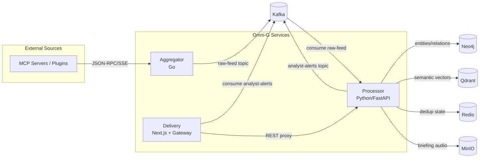
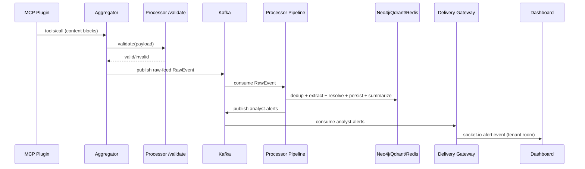
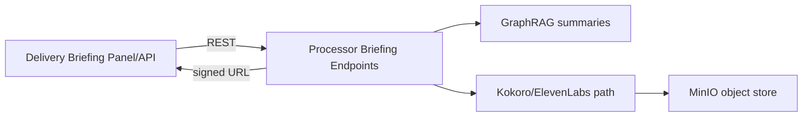
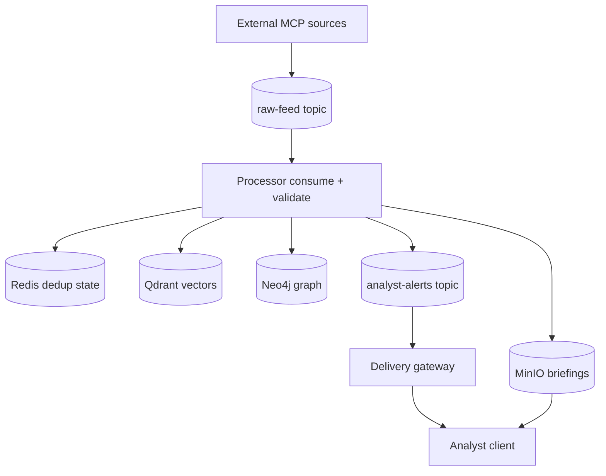
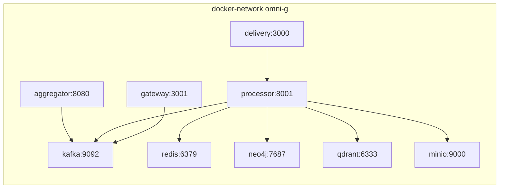

# Omni-G Technical Architecture (arc42)

## 1. Introduction and Goals

### 1.1 Purpose
This document defines the current technical architecture of Omni-G, aligned to the vision in **`AI BI Platform Architecture & Business.md`**, and grounded in the actual implementation state captured in roadmap and code.

### 1.2 Scope
Omni-G is a distributed intelligence platform with three core services:
- **Aggregator (Go):** MCP ingestion edge, schema gate, Kafka producer.
- **Processor (Python):** Kafka consumer, deduplication, STIX extraction, entity resolution, graph persistence, GraphRAG, alert publishing, briefing generation.
- **Delivery (Next.js + Socket.io):** analyst dashboard, WebSocket alert delivery, briefing consumption.

### 1.3 Quality Goals (derived from roadmap + vision)
1. **Event-driven decoupling** through Kafka (durability, replay, loose coupling).
2. **Synthesis-centric UX** (push alerts, briefings, real-time graph awareness).
3. **STIX-first intelligence model** for interoperability.
4. **Tenant isolation** across ingest, processing, and delivery.
5. **Operational resilience** via retries, DLQ, health checks, metrics.

## 2. Architecture Constraints

### 2.1 Technical Constraints
- Core broker: **Kafka (KRaft)**.
- Graph persistence: **Neo4j Community + APOC**.
- Dedup/cache: **Redis Stack**.
- Semantic matching: **Qdrant**.
- LLM extraction/summarization path: **Ollama/OpenAI-compatible APIs**.
- Delivery stack: **Next.js 15 + TypeScript + Sigma.js + Socket.io**.

### 2.2 Organizational / Domain Constraints
- Intelligence workflows must remain **synthesis-centric**, not search-only.
- STIX 2.1 semantics are required for graph objects and relationships.
- Multi-tenant controls cannot be a late retrofit.
- Plugin extensibility requires MCP-oriented ingestion, not hard-coded source adapters.

## 3. Context and Scope

### 3.1 Business Context
```mermaid
flowchart LR
    PluginEcosystem[MCP Plugin Ecosystem] --> AGG[Aggregator]
    AGG --> PROC[Processor]
    PROC --> DEL[Delivery UI/Gateway]
    DEL --> Analyst[Analyst]
    PROC --> ExternalShare[External Sharing / TAXII (target state)]
```

### 3.2 Technical Context


## 4. Solution Strategy

1. **Event-first backbone:** all primary state transitions start from Kafka events.
2. **Validation at ingress + processing:** Aggregator sidecar validation + Processor envelope validation.
3. **Progressive intelligence pipeline:** dedup → extract → resolve → persist → summarize → alert.
4. **Tenant-aware processing fields:** tenant_id propagated in event envelopes, dedup keys, graph writes, and WebSocket rooms.
5. **Observability-first operations:** Prometheus metrics in all core runtime stages.

## 5. Building Block View

### 5.1 Level 1 – System Decomposition
- **Aggregator**
  - MCP client (`tools/list`, `tools/call` over SSE)
  - Scheduler with retries/backoff
  - Validation-sidecar client
  - Kafka producer (`raw-feed`)
- **Processor**
  - Kafka consumer + DLQ writer
  - Content deduplicator (Redis + Lua)
  - LLM extractor (structured STIX output)
  - Entity resolver (Qdrant + Neo4j structural checks)
  - Graph persistence service + schema initializer
  - GraphRAG indexer/summarizer
  - Alert publisher (`analyst-alerts`)
  - Briefing pipeline (script + TTS + MinIO)
- **Delivery**
  - WebSocket gateway (Kafka → Socket.io tenant rooms)
  - Dashboard (Sigma.js visualization, alert highlight)
  - API proxy routes for briefings and graph feed

### 5.2 Level 2 – Principal Internal Interfaces
| Producer | Interface | Consumer | Contract |
|---|---|---|---|
| MCP Plugin | JSON-RPC/SSE | Aggregator Scheduler | `tools/list`, `tools/call` content blocks |
| Aggregator | HTTP POST `/validate` | Processor (current impl) | validation result `{valid, errors[]}`; target is a decoupled validation sidecar/service |
| Aggregator | Kafka `raw-feed` | Processor | `RawEvent` envelope |
| Processor | Kafka `analyst-alerts` | Delivery Gateway | `AnalystAlert` payload |
| Delivery API routes | HTTP REST | Processor | `/briefings`, `/briefings/generate` |

## 6. Runtime View (High-Level Flows)

### 6.1 Ingestion to Alert Flow


### 6.2 Briefing Generation Flow


### 6.3 Data Flow Diagram (DFD-Style)


## 7. Deployment View

### 7.1 Current Deployment (Docker Compose Profiles)
- **core:** Kafka, Redis, Neo4j
- **vector:** Qdrant
- **ai:** Kokoro TTS (Ollama currently commented in compose)
- **storage:** MinIO
- **observability:** Prometheus, Grafana, Loki
- **services:** Aggregator, Processor, Delivery

### 7.2 Deployment Topology


## 8. Cross-Cutting Concepts

### 8.1 Observability
- Prometheus metrics in Aggregator, Processor, Gateway.
- DLQ counters and processing latency metrics in Processor.

### 8.2 Reliability
- Aggregator retries MCP discovery/tool polling with exponential backoff.
- Kafka at-least-once consumption with manual commit and DLQ on failure.
- Redis dedup is fail-open to avoid ingest stoppage.

### 8.3 Security / Isolation (Current vs Target)
- Current: tenant_id propagation exists in several contracts; plugin sandboxing not enforced in runtime.
- Target: strict tenant policy enforcement, LBAC, isolated plugin runtime, immutable audit trail.

### 8.4 Data Governance
- STIX object models exist in Processor.
- Relationship and confidence persistence exists in graph layer.
- `created_by_ref` field exists in models, but end-to-end enforcement is incomplete.

## 9. Data Models and Contracts

### 9.1 Raw Event Envelope (`raw-feed`)
| Field | Type | Notes |
|---|---|---|
| id | string | UUID event identifier |
| source | string | plugin/source URL |
| timestamp | datetime | ingest timestamp |
| payload | object | original content |
| plugin_name | string | provenance |
| plugin_version | string | provenance |
| ingest_latency_ms | int | ingest processing latency |
| schema_version | string | envelope version |
| tenant_id | string | tenant scoping |

### 9.2 Extraction Result (Processor internal)
| Field Group | Notes |
|---|---|
| STIX SDO lists | threat_actor, malware, identity, attack_pattern, campaign, indicator, location |
| STIX SRO list | relationship objects with `relationship_type`, refs, confidence |
| extraction_confidence | float [0..1] used for alert threshold |
| plugin metadata | plugin_id/plugin_version fields for provenance |

### 9.3 Analyst Alert (`analyst-alerts`)
| Field | Type | Purpose |
|---|---|---|
| alert_id | string | unique alert id |
| tenant_id | string | routing to socket room |
| entity_ids | string[] | highlight targets in UI |
| summary | string | analyst-facing text |
| confidence | float | significance |
| timestamp | datetime | latency tracking |
| source_event_id | string | traceability |

### 9.4 Delivery Graph Model
| Model | Core fields |
|---|---|
| GraphNode | id, label, stixType, confidence, communitySummary, x/y |
| GraphEdge | id, source, target, label |

## 10. Quality Requirements and Compliance Mapping

| Requirement | Status | Evidence |
|---|---|---|
| Event-driven decoupling | **Mostly met** | Aggregator→Kafka→Processor, Processor→Kafka→Gateway |
| Synthesis-centric delivery | **Partially met** | alert stream + dashboard + briefing pipeline present |
| STIX alignment | **Partially met** | core STIX models and relationships implemented |
| Multi-tenant isolation | **Partial** | tenant_id in envelopes/rooms/keys; no full access control |
| Plugin sandbox resilience | **Not met** | no enforced gVisor/Firecracker + policy runtime |

## 11. Risks, Deviations, and Critical Gap Analysis

### 11.1 Vision vs Current Architecture Deviations
1. **Tenant isolation remains partial**
   - tenant_id propagation exists, but Neo4j LBAC/federated authorization and end-to-end tenant auth boundaries are not yet complete.
2. **Ingress validation is tightly coupled to Processor availability**
   - Aggregator currently depends on Processor `/validate`; this weakens ingestion/processing decoupling when Processor is degraded.
3. **Sandboxing target not implemented**
   - MCP plugin isolation/runtime policies (gVisor/Firecracker/network allow-list) are not active.
4. **Delivery graph source is still mock**
   - `/api/graph` serves fixture data instead of Processor-mediated graph query results.
5. **Provenance linkage gap (`created_by_ref`)**
   - model field exists; extraction metadata path currently does not guarantee full plugin+analyst provenance population.
6. **Architecture drift in Delivery API contracts**
   - Delivery route expects `/briefings/{id}` while Processor exposes `/briefings` and `/briefings/generate` (contract mismatch risk).
7. **Duplicate persistence pathways**
   - resolver persistence and graph persistence both write to Neo4j in pipeline sequence, increasing model/label consistency risk.
8. **Roadmap/document drift**
   - roadmap marks M5 as not started, while implementation and gap matrix indicate substantial M5 completion.

### 11.2 Anti-Pattern Watchlist (for upcoming phases)
- Do not allow Delivery direct Neo4j access (credentials currently present in Delivery env despite proxy pattern).
- Do not bypass Kafka for cross-service writes.
- Do not duplicate entity resolution logic outside Processor.
- Keep LLM calls bounded; avoid latency inflation in Kafka hot path.

## 12. Recommended Next Architecture Actions

1. **Replace mock graph API first:** prioritize Processor-backed graph query endpoint so analysts see live intelligence instead of fixtures.
2. **Remove direct graph credentials from Delivery runtime:** enforce delivery→processor-only graph access and keep tenant/audit controls centralized.
3. **Close tenancy enforcement gap:** implement query-time tenant enforcement + authorization model (M6.1).
4. **Decouple ingress validation path:** move `/validate` dependency to a dedicated sidecar/service boundary so ingestion survives Processor partial outages.
5. **Normalize Delivery↔Processor API contracts:** adopt one canonical briefing contract (`GET /briefings`, `GET /briefings/{id}`, `POST /briefings`) and align both services.
6. **Harden provenance model:** guarantee `created_by_ref` population and persistence for all graph writes.
7. **Converge Neo4j write model:** use resolver as match-only and keep graph persistence as the single write authority for nodes/edges.
8. **Implement sandboxing baseline:** container isolation + network policy now; gVisor evolution per roadmap.
9. **Reconcile roadmap status artifacts** with actual codebase to prevent planning/implementation divergence.

---

**Primary source alignment:**
- `AI BI Platform Architecture & Business.md`
- `techstack.md`
- `docs/ROADMAP.md`
- `docs/IMPLEMENTATION-PLAN.md`
- `docs/agent-contexts/gap-matrix.md`
- service code and runtime configs under `services/*` and `infrastructure/docker-compose.yml`
