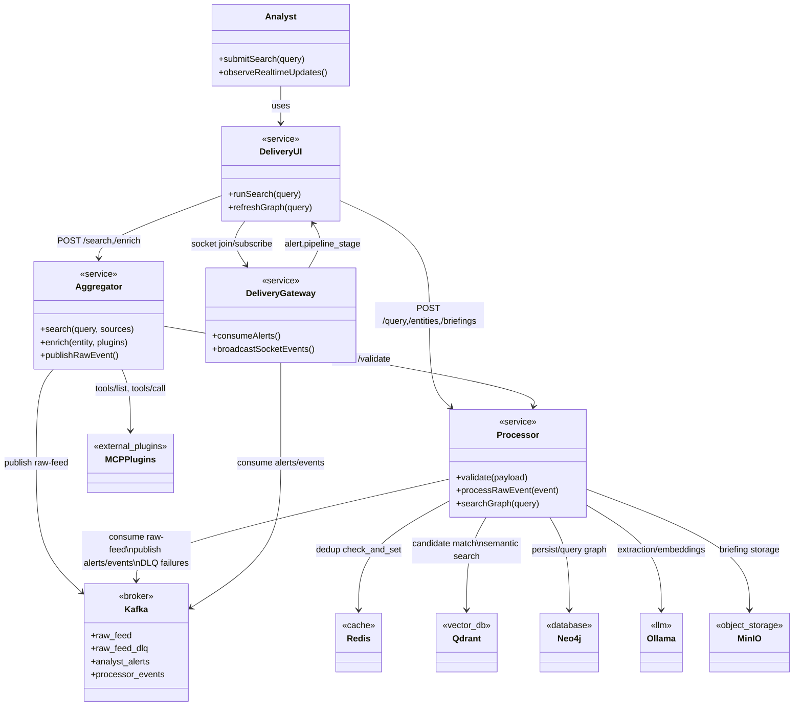
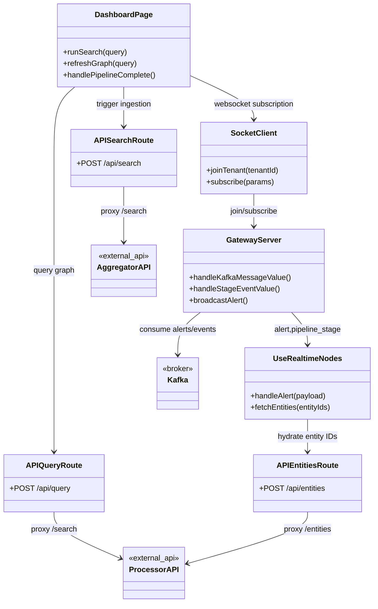
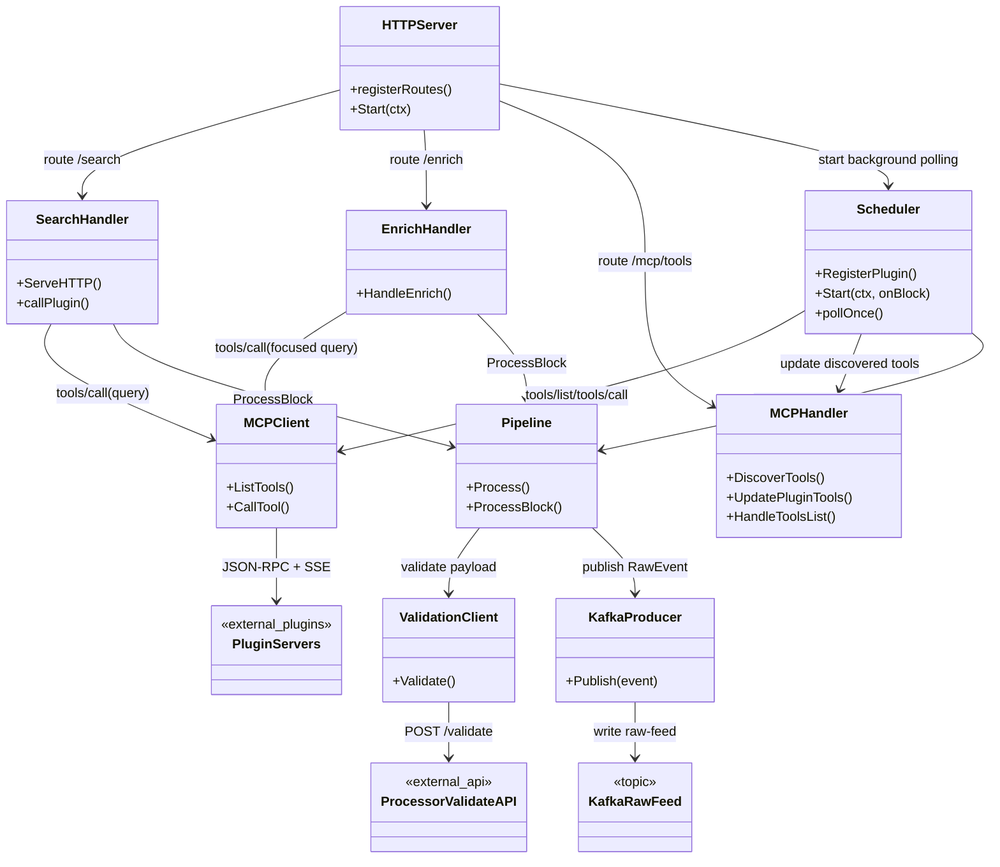
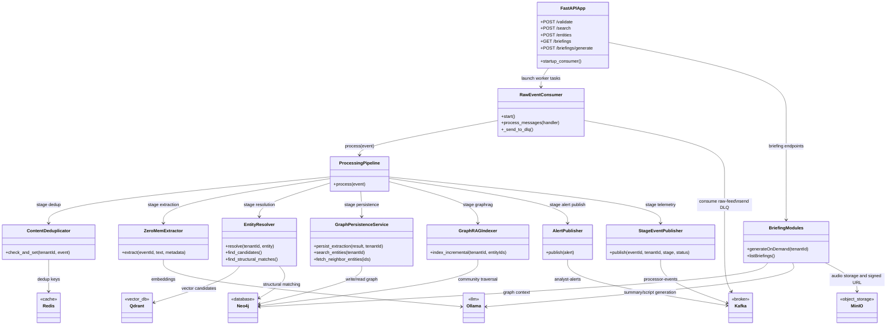

# Omni-G UML Architecture (Code-Derived)

This document replaces the C4 views with UML-style Mermaid diagrams derived from implementation code in services/aggregator, services/processor, and services/delivery.

## 1) UML Class Diagram (System-Level Architecture)



## 2) UML Class Diagram (Delivery Service Internals)



## 3) UML Class Diagram (Aggregator Service Internals)



## 4) UML Class Diagram (Processor Service Internals)



## 5) UML Sequence Diagram (Search to Real-Time Graph Update)

```mermaid
sequenceDiagram
autonumber

actor Analyst
participant UI as Delivery UI
participant Agg as Aggregator
participant MCP as MCP Plugins
participant Val as Processor /validate
participant K as Kafka
participant Proc as Processor Pipeline
participant G as Delivery Gateway
participant Neo as Neo4j
participant Q as Qdrant

Analyst->>UI: Submit search query
UI->>Agg: POST /search
Agg->>MCP: tools/call(query)
MCP-->>Agg: ContentBlock stream
Agg->>Val: POST /validate
Val-->>Agg: {valid:true}
Agg->>K: Publish RawEvent (raw-feed)

K->>Proc: Consume raw-feed
Proc->>Proc: schema -> dedup -> extraction -> grounding
Proc->>Q: candidate matching
Proc->>Neo: persist entities/relationships
Proc->>K: Publish analyst-alerts
Proc->>K: Publish processor-events

K->>G: Consume alerts/events
G-->>UI: Socket alert + pipeline_stage

UI->>Proc: POST /query and /entities
Proc->>Q: semantic query search
Proc->>Neo: fetch neighbors + relationships
Proc-->>UI: entities + relationships
UI-->>Analyst: Updated graph with realtime nodes
