# Omni-G V2 Architecture

## Goal

V2 reshapes Omni-G around the intelligence cycle described in `overhaul.md` while simplifying the current application flow.

The target operating principle is:

1. Define what the system is trying to answer.
2. Collect only the data needed for that objective.
3. Normalize and score the evidence.
4. Test multiple explanations before committing to an assessment.
5. Deliver a BLUF-first output with confidence, gaps, and next actions.

## Core Decisions

- Keep the existing service split: Aggregator, Processor, Delivery.
- Keep Kafka as the event backbone between collection and analysis.
- Replace the Processor's inline long-running tasking model with Celery-based orchestration.
- Move periodic and non-critical enrichment out of the hot path.
- Make KIQs, source evaluation, competing hypotheses, and BLUF dissemination first-class product concepts.

## Intelligence-Cycle Mapping

### 1. Planning and Direction

**Primary owner:** Aggregator

Responsibilities:

- Accept and manage Key Intelligence Questions (KIQs).
- Define collection policies per KIQ, tenant, and source class.
- Map questions to source coverage requirements and refresh cadence.
- Attach KIQ metadata to collected events so downstream analysis stays task-driven.

Target additions:

- KIQ object model
- Collection policy registry
- Source class definitions and weighting rules
- Tasking API for analyst-defined goals

### 2. Collection

**Primary owner:** Aggregator

Responsibilities:

- Discover and call MCP plugins.
- Collect source-tagged evidence from OSINT and internal connectors.
- Normalize collection envelopes before publishing to Kafka.
- Preserve provenance, tenant identity, and KIQ context.

Target changes:

- Classify sources by discipline and reliability tier.
- Enforce source metadata on all raw events.
- Keep plugin orchestration simple and observable.

### 3. Processing and Collation

**Primary owner:** Processor

Responsibilities:

- Validate envelopes.
- Deduplicate content.
- Normalize text and metadata.
- Extract entities, relationships, and evidence spans.
- Score source reliability and information credibility.

Target changes:

- Keep Kafka consumption, but hand work off to Celery tasks.
- Keep the first migration coarse-grained with one `process_event` task per message.
- Add evidence normalization outputs required for later analysis.
- Treat GraphRAG and briefing generation as downstream enrichment, not mandatory hot-path work.

### 4. Analysis and Production

**Primary owner:** Processor

Responsibilities:

- Resolve entities.
- Persist the graph.
- Generate candidate hypotheses.
- Run Analysis of Competing Hypotheses (ACH) over evidence.
- Produce a bounded assessment with confidence and declared intelligence gaps.

Target additions:

- Hypothesis model
- Evidence matrix linking claims to sources
- Contradiction and support scoring
- Probability-band output model
- Re-analysis tasks for scheduled reassessment

### 5. Dissemination

**Primary owner:** Delivery

Responsibilities:

- Present BLUF-first assessments.
- Show supporting evidence, confidence, and intelligence gaps.
- Allow search-first graph exploration.
- Support analyst-triggered enrichment and feedback.

Target changes:

- Add BLUF cards and assessment views alongside the graph.
- Expose probability ranges and source evaluation summaries.
- Show collection gaps and recommended next steps.
- Keep real-time updates, but frame them against KIQs and active assessments.

## Service Responsibilities

## Aggregator

V2 keeps Aggregator as the collection edge, but makes it task-driven rather than generic-feed driven.

Owns:

- KIQ intake and policy binding
- Source registration and plugin discovery
- Collection scheduling and fan-out
- Validation-sidecar calls before Kafka publication
- Event publication to Kafka with KIQ and source metadata

Does not own:

- Entity resolution
- Hypothesis generation
- Graph writes
- Dissemination logic

## Processor

V2 keeps Processor as the analytical core, but changes its execution model.

Owns:

- Kafka intake and DLQ behavior
- Celery task orchestration
- Validation, deduplication, extraction, grounding, scoring
- Entity resolution and graph persistence
- ACH and assessment production
- Background analytical jobs such as briefings, re-analysis, and graph maintenance

Does not own:

- Plugin orchestration
- Analyst-facing presentation

## Delivery

V2 keeps Delivery as the analyst surface.

Owns:

- Search-driven graph UI
- BLUF-first dissemination views
- Real-time alert and status updates
- Assessment drill-downs
- Analyst feedback and enrichment triggers

Does not own:

- Raw ingestion
- Long-running analysis jobs
- Direct graph writes

## Runtime Flow

```mermaid
flowchart LR
    A[Analyst defines KIQ] --> B[Aggregator tasking and collection policy]
    B --> C[MCP plugins and source connectors]
    C --> D[Kafka raw-feed]
    D --> E[Processor Kafka consumer]
    E --> F[Celery process_event task]
    F --> G[Validate and dedup]
    G --> H[Extract and ground evidence]
    H --> I[Score source and information]
    I --> J[Resolve entities and persist graph]
    J --> K[ACH and assessment production]
    K --> L[Kafka analyst-alerts and processor-events]
    K --> M[Background enrichment tasks]
    L --> N[Delivery BLUF and graph UI]
    M --> N
```

## Orchestration Model

### Current problem

The current Processor executes the main pipeline inline inside the Kafka consumer worker. That couples ingestion throughput to LLM latency and to all downstream analytical stages.

### V2 target

- Kafka remains the ingestion and replay boundary.
- The Processor consumer becomes a dispatcher.
- Celery workers execute the analytical workload.
- Celery Beat replaces ad hoc scheduler-style periodic tasks.

### First migration step

Keep the current `ProcessingPipeline.process()` logic together and queue it as a single Celery task per event. This avoids a risky refactor at the same time as the architectural overhaul.

### Later migration step

Split the coarse task into stage-aware queues when the domain model stabilizes:

- `process_event`
- `analysis_enrichment`
- `graph_maintenance`
- `briefing_generation`
- `scheduled_collection_review`

## Domain Model Additions

V2 extends the current generic entity graph with assessment-oriented records.

Required additions:

- `KIQ` — the question, scope, owner, threshold, and review cadence
- `CollectedEvidence` — source, source class, reliability, credibility, text span, timestamp
- `Hypothesis` — candidate explanation linked to a KIQ
- `Assessment` — BLUF summary, confidence band, supporting evidence, contradictory evidence, gaps, recommended action
- `CollectionGap` — what is missing and which source classes could close it

## Simplifications

V2 explicitly simplifies the system in these ways:

- GraphRAG is no longer treated as mandatory hot-path output.
- APScheduler-style tasking should be replaced by Celery Beat.
- Generic "interesting things" output is secondary to KIQ-bound assessments.
- Real-time updates should point back to an active KIQ or assessment whenever possible.

## Migration Principles

- Preserve tenant isolation throughout the redesign.
- Preserve provenance for every evidence object.
- Keep the first runtime migration incremental.
- Prefer background analytical enrichment over blocking hot-path execution.
- Keep the local development path viable on constrained hardware.
